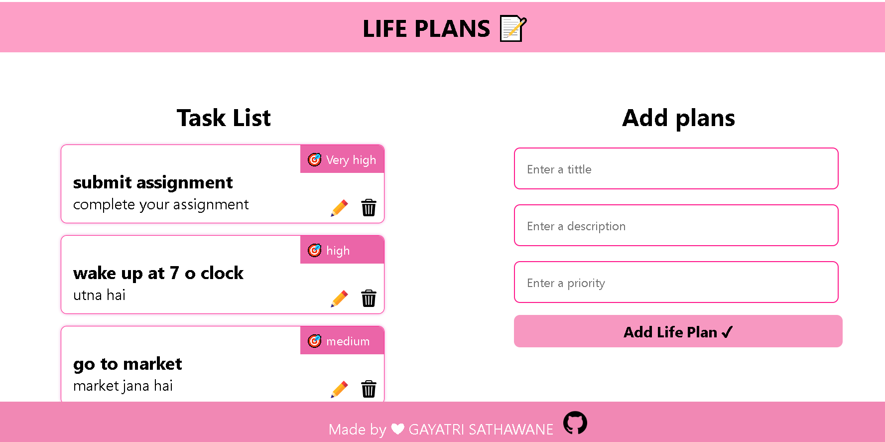

## LIFE PLANS 📃

A fully functional Life-plans web application built with React! 

### Key Features:
1. Create and manage your to-do list with ease.
2. Mark tasks as complete 
3. you can Add ,Edit, Delete the lit oof task .
4. save in localstorage
5. Clean and user-friendly interface.
6. Responsive and secure.
### Tech Stack:
React: Building a dynamic and interactive front-end.

JavaScript: Adding functionality and logic.

CSS: Styling for an appealing UI.

